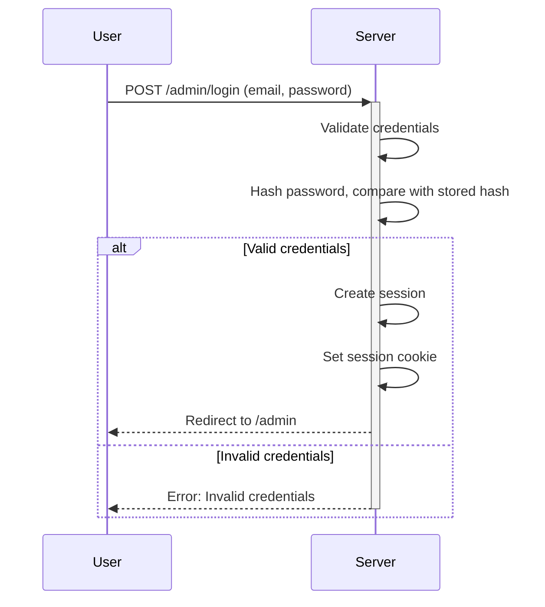
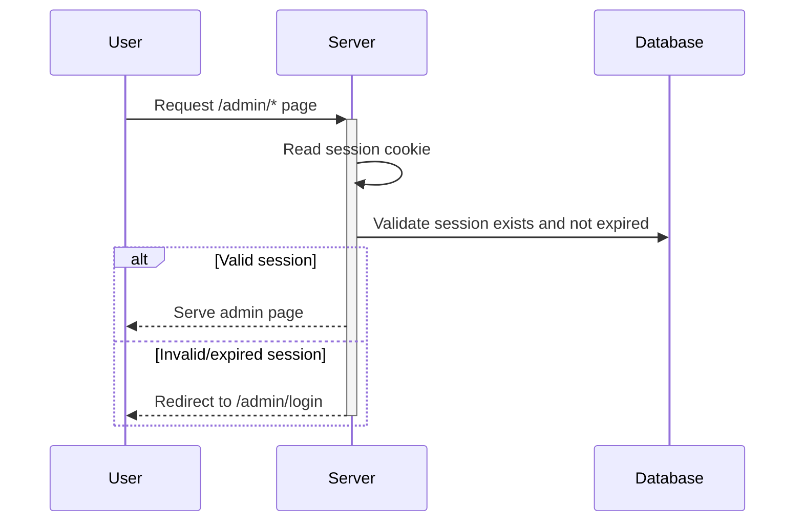
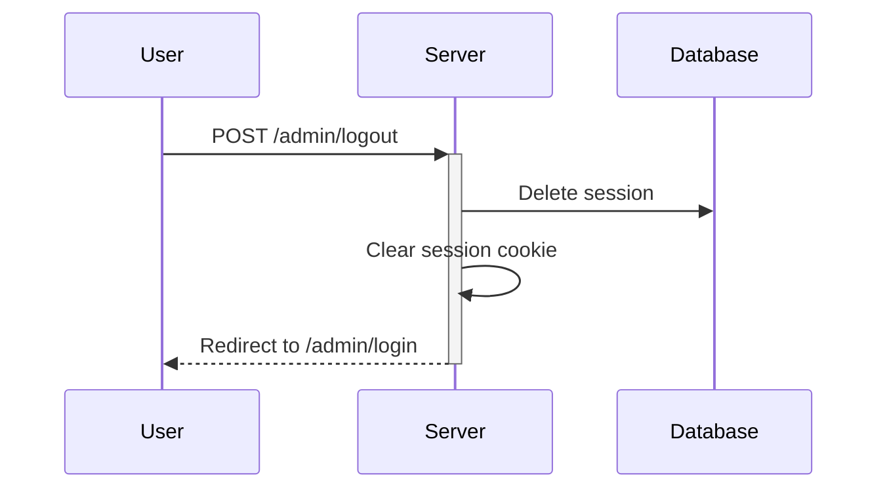

# Authentication Specification

## Overview

Authentication secures the admin panel, ensuring only authorised users can manage content. The system uses session-based authentication with secure password hashing.

## Requirements

- Single admin user (can be extended to multiple users later)
- Session-based authentication
- Secure password storage
- Remember me functionality
- Logout capability

## Authentication Flow

### Login



### Session Validation



### Logout



## Data Models

### User

```typescript
interface User {
  id: string;
  email: string;
  passwordHash: string;
  createdAt: Date;
  updatedAt: Date;
}
```

### Session

```typescript
interface Session {
  id: string;
  userId: string;
  expiresAt: Date;
  createdAt: Date;
}
```

## Implementation

### Password Hashing

Use bcrypt for secure password hashing:

```typescript
import bcrypt from 'bcrypt';

const SALT_ROUNDS = 12;

export async function hashPassword(password: string): Promise<string> {
  return bcrypt.hash(password, SALT_ROUNDS);
}

export async function verifyPassword(password: string, hash: string): Promise<boolean> {
  return bcrypt.compare(password, hash);
}
```

### Session Management

```typescript
import { randomBytes } from 'crypto';

const SESSION_DURATION = 7 * 24 * 60 * 60 * 1000; // 7 days

export function generateSessionId(): string {
  return randomBytes(32).toString('hex');
}

export async function createSession(userId: string): Promise<Session> {
  const session = {
    id: generateSessionId(),
    userId,
    expiresAt: new Date(Date.now() + SESSION_DURATION),
    createdAt: new Date(),
  };
  
  await db.insert(sessions).values(session);
  return session;
}

export async function validateSession(sessionId: string): Promise<Session | null> {
  const session = await db.query.sessions.findFirst({
    where: eq(sessions.id, sessionId),
  });
  
  if (!session || session.expiresAt < new Date()) {
    return null;
  }
  
  return session;
}

export async function deleteSession(sessionId: string): Promise<void> {
  await db.delete(sessions).where(eq(sessions.id, sessionId));
}
```

### Cookie Configuration

```typescript
const SESSION_COOKIE_NAME = 'session';

export function setSessionCookie(cookies: Cookies, sessionId: string): void {
  cookies.set(SESSION_COOKIE_NAME, sessionId, {
    path: '/',
    httpOnly: true,
    secure: true, // Set to false for local development
    sameSite: 'lax',
    maxAge: 7 * 24 * 60 * 60, // 7 days in seconds
  });
}

export function clearSessionCookie(cookies: Cookies): void {
  cookies.delete(SESSION_COOKIE_NAME, { path: '/' });
}
```

## Route Protection

### SvelteKit Hooks

```typescript
// src/hooks.server.ts
import type { Handle } from '@sveltejs/kit';
import { redirect } from '@sveltejs/kit';
import { validateSession } from '$lib/server/auth';

export const handle: Handle = async ({ event, resolve }) => {
  const sessionId = event.cookies.get('session');
  
  if (event.url.pathname.startsWith('/admin')) {
    // Allow login page without authentication
    if (event.url.pathname === '/admin/login') {
      return resolve(event);
    }
    
    if (!sessionId) {
      throw redirect(303, '/admin/login');
    }
    
    const session = await validateSession(sessionId);
    if (!session) {
      throw redirect(303, '/admin/login');
    }
    
    // Attach user to locals for use in routes
    event.locals.session = session;
  }
  
  return resolve(event);
};
```

### Type Definitions

```typescript
// src/app.d.ts
declare global {
  namespace App {
    interface Locals {
      session?: Session;
    }
  }
}
```

## Login Page

### Route: `/admin/login`

```svelte
<!-- src/routes/admin/login/+page.svelte -->
<script lang="ts">
  import { enhance } from '$app/forms';
</script>

<form method="POST" use:enhance>
  <label>
    Email
    <input type="email" name="email" required />
  </label>
  
  <label>
    Password
    <input type="password" name="password" required />
  </label>
  
  <button type="submit">Login</button>
</form>
```

### Form Action

```typescript
// src/routes/admin/login/+page.server.ts
import type { Actions } from './$types';
import { fail, redirect } from '@sveltejs/kit';
import { verifyPassword, createSession, setSessionCookie } from '$lib/server/auth';

export const actions: Actions = {
  default: async ({ request, cookies }) => {
    const data = await request.formData();
    const email = data.get('email') as string;
    const password = data.get('password') as string;
    
    const user = await db.query.users.findFirst({
      where: eq(users.email, email),
    });
    
    if (!user || !await verifyPassword(password, user.passwordHash)) {
      return fail(401, { error: 'Invalid email or password' });
    }
    
    const session = await createSession(user.id);
    setSessionCookie(cookies, session.id);
    
    throw redirect(303, '/admin');
  },
};
```

## Security Considerations

### Password Requirements
- Minimum 12 characters
- No common password check (optional)
- Rate limiting on login attempts

### Rate Limiting

```typescript
const LOGIN_ATTEMPTS = new Map<string, { count: number; lastAttempt: number }>();
const MAX_ATTEMPTS = 5;
const LOCKOUT_DURATION = 15 * 60 * 1000; // 15 minutes

export function checkRateLimit(ip: string): boolean {
  const record = LOGIN_ATTEMPTS.get(ip);
  
  if (!record) return true;
  
  if (Date.now() - record.lastAttempt > LOCKOUT_DURATION) {
    LOGIN_ATTEMPTS.delete(ip);
    return true;
  }
  
  return record.count < MAX_ATTEMPTS;
}

export function recordLoginAttempt(ip: string): void {
  const record = LOGIN_ATTEMPTS.get(ip);
  
  if (record) {
    record.count++;
    record.lastAttempt = Date.now();
  } else {
    LOGIN_ATTEMPTS.set(ip, { count: 1, lastAttempt: Date.now() });
  }
}
```

### Session Cleanup

Periodic cleanup of expired sessions:

```typescript
export async function cleanupExpiredSessions(): Promise<void> {
  await db.delete(sessions).where(lt(sessions.expiresAt, new Date()));
}
```

Run on server startup or via scheduled task.

## Initial Admin Setup

Create a setup script for the initial admin user:

```typescript
// scripts/create-admin.ts
import { db } from '$lib/server/db';
import { users } from '$lib/server/db/schema';
import { hashPassword } from '$lib/server/auth';
import { randomUUID } from 'crypto';

async function createAdmin(email: string, password: string) {
  const passwordHash = await hashPassword(password);
  
  await db.insert(users).values({
    id: randomUUID(),
    email,
    passwordHash,
  });
  
  console.log(`Admin user created: ${email}`);
}

// Usage: npx tsx scripts/create-admin.ts admin@example.com securepassword
const [email, password] = process.argv.slice(2);
createAdmin(email, password);
```

## Dependencies

```bash
npm install bcrypt
npm install -D @types/bcrypt
```
